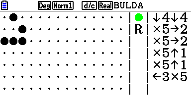

# Bulda

A long time ago in a galaxy far far away and ages before Arendelle there was Bulda. It was originally made for [CASIO Prizm](http://www.casioeducation.com/products/Calculators_%26_Dictionaries/Graphing/PRIZM_fx-CG10) ( fx-CG10 and fx-CG20 ). This repository contains the original source code for the Bulda.

There is a modern simulation of Bulda written in Arendelle itself that you can find as [bulda.arendelle](https://github.com/arendelle/bulda.arendelle). 

# How it works?

Bulda is the simplest kind of Arendelle. It has 5 commands like this:

| Bulda Code  | Arendelle Alternative  | What it does!           |
|:------------|:-----------------------|:------------------------|
| `5`         | `p`                    | Prints the current dot  |
| `1`         | `u`                    | Goes one dot up         |
| `2`         | `r`                    | Goes one dot right      |
| `3`         | `l`                    | Goes one dot left       |
| `4`         | `d`                    | Goes one dot down       |

However the core Bulda uses the Kary-String-Number formula:


The fact with the system is it reads the sequence right-to-left so you have to write the code right-to-left. For example if you have the code in Arendelle as:

```
rpldpdplplp
```

Then you can write it in the Bulda as:

```
535354542525
```

And yes it can be confusing but you will come to be very good at it soon. And if you gave up with it just download a good version of Arendelle!


## License

```
Bulda - The original first clue of Arendelle
   Copyright (c) 2014-2016 Kary Foundation, Inc.
   Author: Pouya Kary <k@karyfoundation.org>

This program is free software: you can redistribute it and/or modify
it under the terms of the GNU General Public License as published by
the Free Software Foundation, either version 3 of the License, or
(at your option) any later version.

This program is distributed in the hope that it will be useful,
but WITHOUT ANY WARRANTY; without even the implied warranty of
MERCHANTABILITY or FITNESS FOR A PARTICULAR PURPOSE.  See the
GNU General Public License for more details.

You should have received a copy of the GNU General Public License
along with this program.  If not, see <http://www.gnu.org/licenses/>.
```
